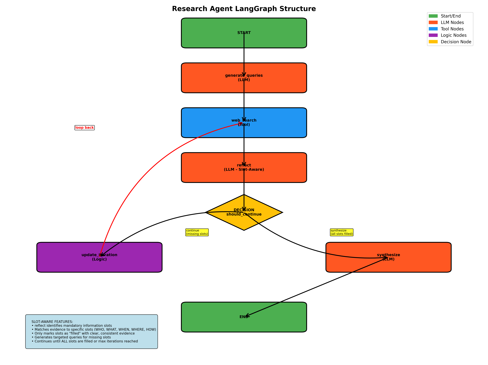

# LLM Research Agent

A sophisticated LangGraph-based research agent that uses **slot-aware reflection** to intelligently answer questions by generating targeted search queries, searching the web, and synthesizing comprehensive answers with structured citations.

## 🚀 Key Features

- **🔍 Slot-Aware Research**: Identifies mandatory information slots and ensures all are filled before synthesis
- **🔄 Multi-Iteration Intelligence**: Continues searching until all required information is gathered
- **⚡ Concurrent Search**: Parallel web searches using Google Custom Search API
- **📝 Clean Output**: Direct, concise answers (≤80 words) with structured citations
- **🎯 Targeted Queries**: Generates specific queries for missing information slots
- **🌐 Web Interface**: Next.js frontend for easy interaction
- **🐳 Docker Ready**: Complete containerized setup
- **🛡️ Robust Error Handling**: Graceful fallbacks and comprehensive testing

## 🏗️ Architecture



```
┌─────────────────┐    ┌─────────────────┐    ┌─────────────────┐    ┌─────────────────┐
│  GenerateQueries│───▶│  WebSearchTool  │───▶│  Slot-Aware     │───▶│   Synthesize    │
│                 │    │                 │    │     Reflect     │    │                 │
│ • Break question│    │ • Concurrent    │    │ • Identify      │    │ • Create direct │
│   into 3-5      │    │   Google CSE    │    │   mandatory     │    │   answer (≤80   │
│   queries       │    │   searches      │    │   slots         │    │   words)        │
│ • Return JSON   │    │ • Merge &       │    │ • Match evidence│    │ • Structured    │
│   array         │    │   deduplicate   │    │   to slots      │    │   citations     │
└─────────────────┘    └─────────────────┘    └─────────────────┘    └─────────────────┘
                                │                       │
                                ▼                       ▼
                       ┌─────────────────┐    ┌─────────────────┐
                       │   Should        │    │   Update        │
                       │   Continue?     │    │   Iteration     │
                       │                 │    │                 │
                       │ • All slots     │    │ • Increment     │
                       │   filled?       │    │   counter       │
                       │ • Need more?    │    │ • Set targeted  │
                       │ • Max iter?     │    │   queries       │
                       └─────────────────┘    └─────────────────┘
```

## Project Workflow Overview

The workflow for this project is divided into **three parts**:

1. **Core AI Agent functionality** (with slot implementations)
2. **Backend using FastAPI** to run the agent in the background
3. **Basic Frontend for Chat functionality** using React, Tailwind, and TypeScript

---

## AI Agent Workflow

### 1. Question Input & Query Generation

* The agent receives a user question.
* The `generate_queries` LLM node analyzes the input to create 3–5 specific search queries.
* **Example:**
  Question: *"Who won the 2022 FIFA World Cup?"*
  Generated Queries:

  * `2022 FIFA World Cup winner`
  * `World Cup 2022 final result`
  * `Argentina France 2022 World Cup final`

---

### 2. Concurrent Web Search

* The `web_search` tool node executes all queries simultaneously using the **Google Custom Search API**.
* Merges results, removes duplicates by URL.
* Handles API failures gracefully (fallback to mock search).

---

### 3. Slot-Aware Reflection

* The `reflect` LLM node processes the search results with slot-aware logic:

  * Identifies mandatory information slots: **WHO, WHAT, WHEN, WHERE, HOW**
  * Matches evidence sentences to specific slots.
  * Validates information quality (only accepts clear, consistent evidence).
  * Generates new targeted queries for any missing slots.

---

### 4. Decision Point

* The `should_continue` logic node determines the next step:

  * **Continue** if mandatory slots are missing and new queries are available.
  * **Synthesize** if all slots are filled or max iterations reached.

---

### 5A. Continue Path (Iterative Refinement)

* If continuing, the `update_iteration` node:

  * Increments iteration counter.
  * Sets new targeted queries for missing slots.
  * Clears previous results but retains identified slots.
  * Loops back to `web_search`.

---

### 5B. Synthesize Path (Final Answer)

* If synthesizing, the `synthesize` LLM node:

  * Produces a **concise answer (≤80 words)** with all filled slots.
  * Adds **structured citations**: `id`, `title`, `url`.
  * Ensures answer quality and completeness.

---

### 6. Final Output

Returns a structured **JSON response** containing:

* Final answer with citations
* List of identified and filled slots
* Iteration count
* All supporting metadata


## 🎯 Slot-Aware Research System

The agent uses an advanced slot-based approach to ensure comprehensive answers:

### How It Works

1. **Slot Identification**: Analyzes the question to identify mandatory information slots
   - WHO questions: `winner`, `opponent`, `participants`, `key_people`
   - WHAT questions: `definition`, `features`, `characteristics`
   - WHEN questions: `date`, `time_period`, `duration`
   - WHERE questions: `location`, `venue`, `place`
   - HOW questions: `method`, `process`, `steps`

2. **Evidence Matching**: Examines search results to match information to specific slots

3. **Completeness Validation**: Only proceeds when ALL mandatory slots are filled with consistent evidence

4. **Targeted Refinement**: Generates specific queries for missing or unclear slots

### Example Output

```json
{
  "answer": "Argentina won the 2022 FIFA World Cup, beating France on penalties after a 3-3 draw. The final was played on 18 December 2022 at Lusail Stadium in Lusail, Qatar.[1][5][6][7]",
  "citations": [
    {
      "id": 1,
      "title": "2022 FIFA World Cup final - Wikipedia",
      "url": "https://en.wikipedia.org/wiki/2022_FIFA_World_Cup_final"
    }
  ],
  "slots": ["winner", "opponent", "score", "date", "venue"],
  "filled_slots": ["winner", "opponent", "score", "date", "venue"],
  "iterations": 6
}
```

## 🚀 Quick Start

### Prerequisites

- Docker and Docker Compose
- API keys (optional - falls back to mock search)

### Operation Modes

The research agent can be run in three different modes:

1. **🔧 CLI Mode**: Direct command-line interface for single queries
2. **🖥️ API Server Mode**: FastAPI server for programmatic access
3. **🌐 Full Stack Mode**: Complete web interface with frontend and backend

### Environment Variables

Create a `.env` file:

```bash
# LLM Provider (choose one)
GEMINI_API_KEY=your_gemini_key_here
# OR
OPENAI_API_KEY=your_openai_key_here

# Google Custom Search API (optional)
GOOGLE_CSE_API_KEY=your_google_cse_key_here
GOOGLE_CSE_CX=your_custom_search_engine_id_here
```

### 🐳 Docker Usage

#### Backend Only (CLI Mode)

```bash
# Run a single query
docker compose run --rm agent "Who won the 2022 FIFA World Cup?"

# Run with custom environment
docker compose run --rm -e GEMINI_API_KEY=your_key agent "What is machine learning?"
```

#### Backend API Server Mode

```bash
# Start the API server
docker compose run --rm -p 8000:8000 api

# Or start with custom environment
docker compose run --rm -p 8000:8000 -e GEMINI_API_KEY=your_key api
```

#### Full Stack (Frontend + Backend)

```bash
# Start the complete system
docker compose up

# Access the web interface
open http://localhost:3000

# Access the API server
open http://localhost:8000/docs
```

### 🏃‍♂️ Local Development

#### Backend Setup

```bash
# Install Python dependencies
pip install -r requirements.txt

# Run the agent (CLI mode)
python src/main.py "What is Python programming?"

# Run the API server (backend mode)
python src/api_server.py

# Run tests
python -m pytest tests/ -v
```

#### Frontend Setup

```bash
# Navigate to frontend directory
cd frontend

# Install dependencies
npm install

# Start development server
npm run dev

# Build for production
npm run build
```

### 🖥️ Backend API Server

The backend provides a FastAPI server for programmatic access to the research agent.

#### Running the API Server

```bash
# Method 1: Direct Python execution
python src/api_server.py

# Method 2: Using uvicorn directly
uvicorn src.api_server:app --host 0.0.0.0 --port 8000 --reload

# Method 3: Using Docker
docker compose run --rm -p 8000:8000 api
```

#### API Server Features

- **FastAPI Framework**: High-performance async API
- **CORS Support**: Cross-origin requests enabled
- **Health Check**: `/health` endpoint for monitoring
- **Interactive Docs**: Auto-generated Swagger UI at `/docs`
- **Hot Reload**: Development mode with automatic restarts

#### API Endpoints

```bash
# Health check
curl http://localhost:8000/health

# Ask a question
curl -X POST http://localhost:8000/ask \
  -H "Content-Type: application/json" \
  -d '{"question": "Who won the 2022 FIFA World Cup?"}'

# Interactive API documentation
open http://localhost:8000/docs
```

#### Environment Variables for API Server

```bash
# Required for LLM functionality
GEMINI_API_KEY=your_gemini_key_here
# OR
OPENAI_API_KEY=your_openai_key_here

# Optional for web search
GOOGLE_CSE_API_KEY=your_google_cse_key_here
GOOGLE_CSE_CX=your_custom_search_engine_id_here
```

## 📁 Project Structure

```
research-agent/
├── src/
│   ├── agent/
│   │   ├── __init__.py
│   │   ├── state.py          # State management with slots
│   │   ├── prompts.py        # Enhanced slot-aware prompts
│   │   ├── tools.py          # Google CSE + Mock search tools
│   │   ├── nodes.py          # Pipeline nodes with slot logic
│   │   ├── graph.py          # LangGraph setup
│   │   └── llm_factory.py    # LLM initialization
│   ├── api_server.py         # FastAPI backend server
│   └── main.py               # CLI entry point
├── frontend/
│   ├── src/
│   │   ├── app/
│   │   │   ├── api/          # Next.js API routes
│   │   │   ├── page.tsx      # Main UI component
│   │   │   └── layout.tsx    # App layout
│   │   └── ...
│   ├── package.json
│   └── next.config.ts
├── tests/
│   ├── test_agent.py         # Comprehensive unit tests
│   └── ...
├── Dockerfile
├── compose.yaml
├── requirements.txt
└── README.md
```

## 🧪 Testing

The project includes comprehensive tests for the slot-aware system:

```bash
# Run all tests
docker compose run --rm --entrypoint="" agent python -m pytest tests/ -v

# Test specific functionality
docker compose run --rm --entrypoint="" agent python -m pytest tests/test_agent.py::TestAgentIntegration::test_agent_slot_aware_integration -v
```

### Test Coverage

- ✅ **Slot Identification**: Tests for proper slot extraction
- ✅ **Evidence Matching**: Tests for slot filling logic
- ✅ **Completeness Validation**: Tests that all slots must be filled
- ✅ **Targeted Query Generation**: Tests for missing slot queries
- ✅ **Multi-Iteration Scenarios**: Tests for complex research flows
- ✅ **Error Handling**: Tests for API failures and edge cases

## 🔧 Configuration

### Docker Compose Services

```yaml
services:
  agent:
    build: .
    environment:
      - GEMINI_API_KEY=${GEMINI_API_KEY}
      - GOOGLE_CSE_API_KEY=${GOOGLE_CSE_API_KEY}
      - GOOGLE_CSE_CX=${GOOGLE_CSE_CX}
    volumes:
      - ./src:/app/src
    command: ["python", "src/main.py"]

  api:
    build: .
    ports:
      - "8000:8000"
    environment:
      - GEMINI_API_KEY=${GEMINI_API_KEY}
    command: ["python", "src/api_server.py"]

  frontend:
    build: ./frontend
    ports:
      - "3000:3000"
    depends_on:
      - api
```

### API Endpoints

#### Backend API (FastAPI) - Port 8000

```bash
# Health check
curl http://localhost:8000/health

# Ask a question
curl -X POST http://localhost:8000/ask \
  -H "Content-Type: application/json" \
  -d '{"question": "Who won the 2022 FIFA World Cup?"}'

# Interactive API documentation
open http://localhost:8000/docs

# Alternative: ReDoc documentation
open http://localhost:8000/redoc
```

#### Frontend API (Next.js) - Port 3000

```bash
# Frontend proxy to backend
curl -X POST http://localhost:3000/api/ask \
  -H "Content-Type: application/json" \
  -d '{"question": "What is machine learning?"}'
```

#### Example API Response

```json
{
  "answer": "Argentina won the 2022 FIFA World Cup, beating France on penalties after a 3-3 draw. The final was played on 18 December 2022 at Lusail Stadium in Lusail, Qatar.[1][5][6][7]",
  "citations": [
    {
      "id": 1,
      "title": "2022 FIFA World Cup final - Wikipedia",
      "url": "https://en.wikipedia.org/wiki/2022_FIFA_World_Cup_final"
    }
  ],
  "slots": ["winner", "opponent", "score", "date", "venue"],
  "filled_slots": ["winner", "opponent", "score", "date", "venue"],
  "iterations": 6
}
```

## 🎨 Frontend Features

The Next.js frontend provides:

- **📝 Question Input**: Clean interface for asking questions
- **🔄 Real-time Results**: Immediate display of research results
- **📚 Citation Display**: Structured citation viewing with links
- **📊 Slot Information**: Visual display of slot analysis
- **🎯 Raw JSON Toggle**: Debug view of complete response
- **🌙 Dark Mode**: Modern UI with dark/light theme support

## 🔍 Search Strategy

### Google Custom Search API

- **Concurrent Execution**: All queries run in parallel
- **Result Deduplication**: URL-based deduplication
- **Rate Limiting**: Proper handling of API limits
- **Fallback Mode**: Mock search for offline development

### Mock Search Tool

For development and testing without API keys:

```python
# Pre-configured mock data for common queries
mock_data = {
    "who won the 2022 fifa world cup": [
        {
            "title": "Argentina win World Cup 2022",
            "snippet": "Argentina won the 2022 FIFA World Cup, beating France 4-2 on penalties after a 3-3 draw in extra time.",
            "url": "https://www.fifa.com/worldcup/news/argentina-win"
        }
    ]
}
```

## 🚀 Performance Optimizations

- **Concurrent Searches**: Parallel query execution
- **Smart Caching**: Result deduplication and reuse
- **Iteration Limits**: Prevents infinite loops (max 2 iterations)
- **Error Recovery**: Continues operation despite individual failures
- **Structured Output**: Efficient JSON parsing with fallbacks

## 🔒 Security & Best Practices

- **Environment Variables**: No hardcoded API keys
- **Input Validation**: Question sanitization and length limits
- **Error Handling**: Graceful degradation and safe error messages
- **Rate Limiting**: Proper API quota management
- **Container Security**: Isolated Docker environments

## 🤝 Contributing

1. Fork the repository
2. Create a feature branch
3. Add tests for new functionality
4. Ensure all tests pass
5. Submit a pull request

## 📄 License

This project is licensed under the MIT License - see the LICENSE file for details.

## 🙏 Acknowledgments

- **LangGraph**: For the powerful graph-based workflow framework
- **Google Custom Search API**: For web search capabilities
- **Next.js**: For the modern frontend framework
- **FastAPI**: For the high-performance backend API 